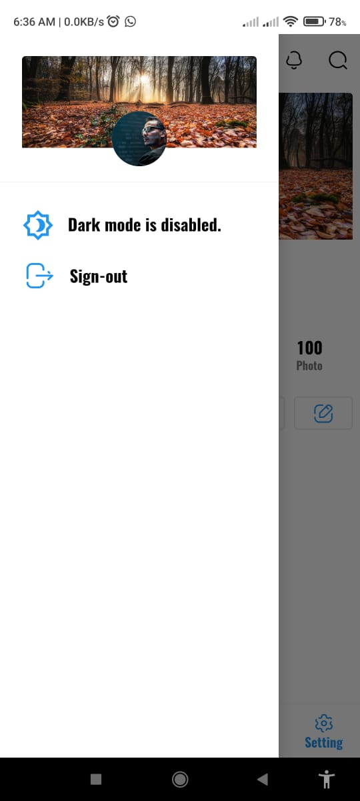
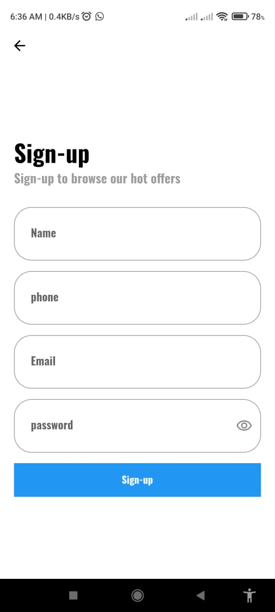
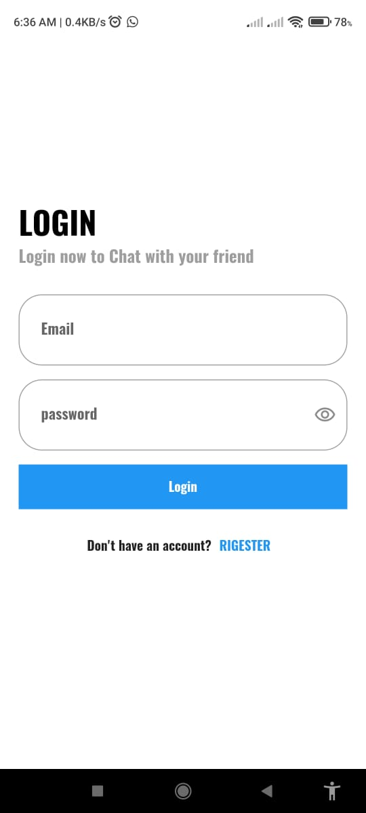
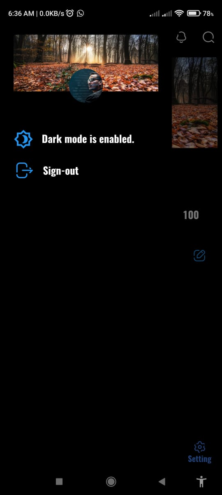
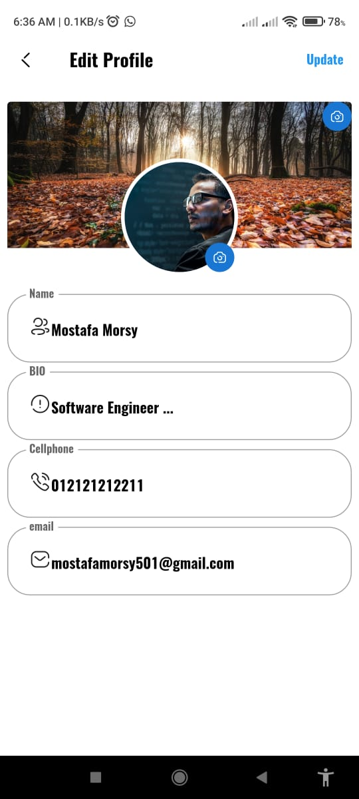
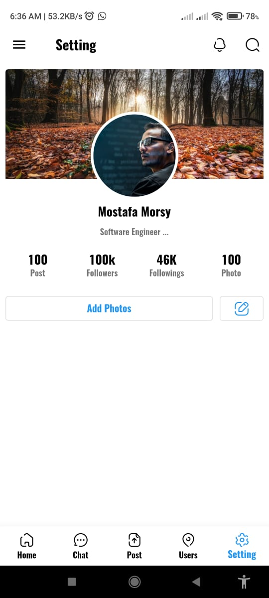
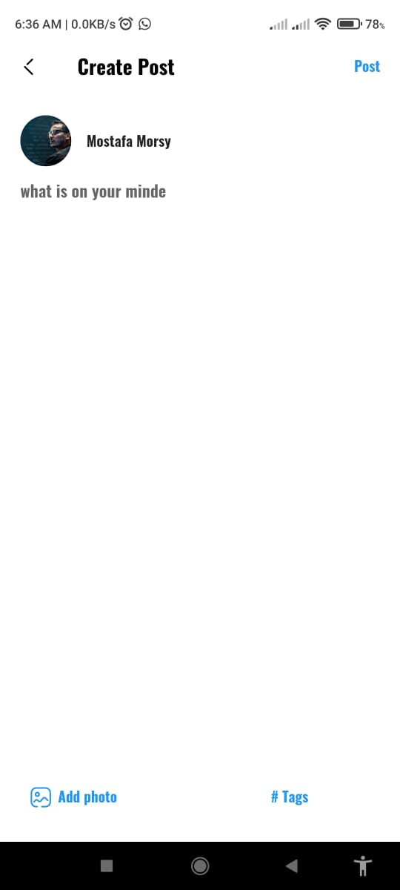
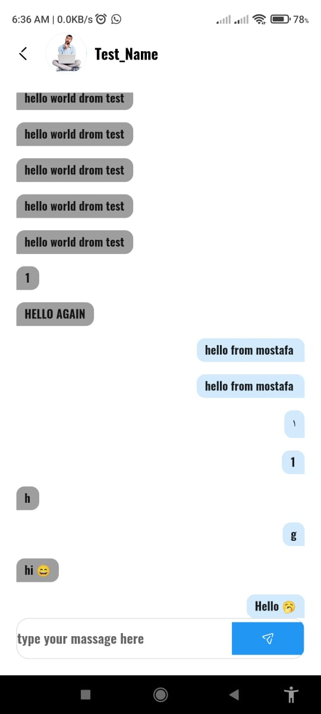
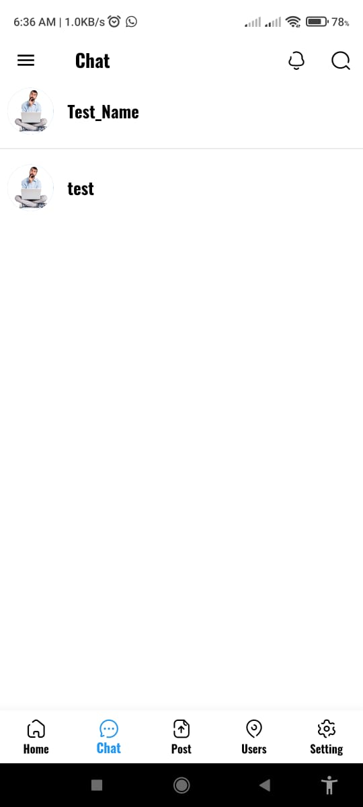
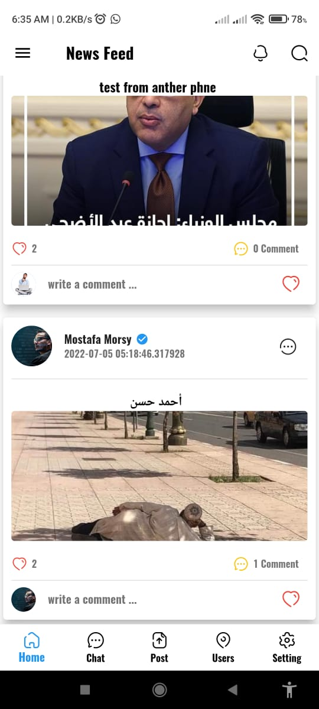

# Social App

## Introduction:

    Let me give you a brief overview of the project, 
    Contain an Auth methode (Login - Signup)  also profile screen to edit the user profile.
    there is anther 4 screen: News Feed to show Posts  in addition to  lijes and comments,
    and as a second screen is a chat screen to show the users,
    also The New post  Screen to can add new post,
    Finally, The setting screen.

## This Project Created use :
        - Sign-In, Sign-Up and Log_out using Email & Password by Firebase .
        - Edit your account information and upload image at Profile section.
        - Using Responsive UI.
        - Using Firebase ,FCM, Sheard prefrence.
        - Using Cubit as state management.
        - Using MVC as Architect Design.

## ScreenShots

